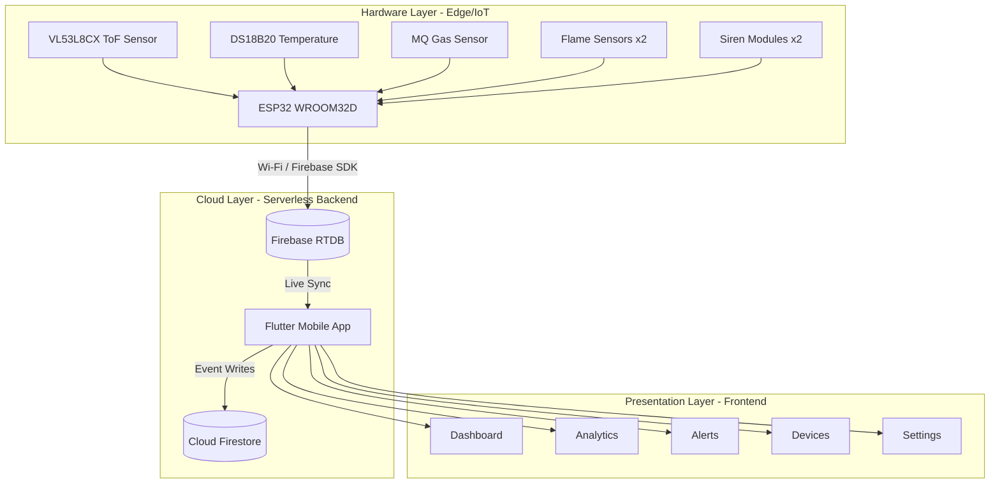
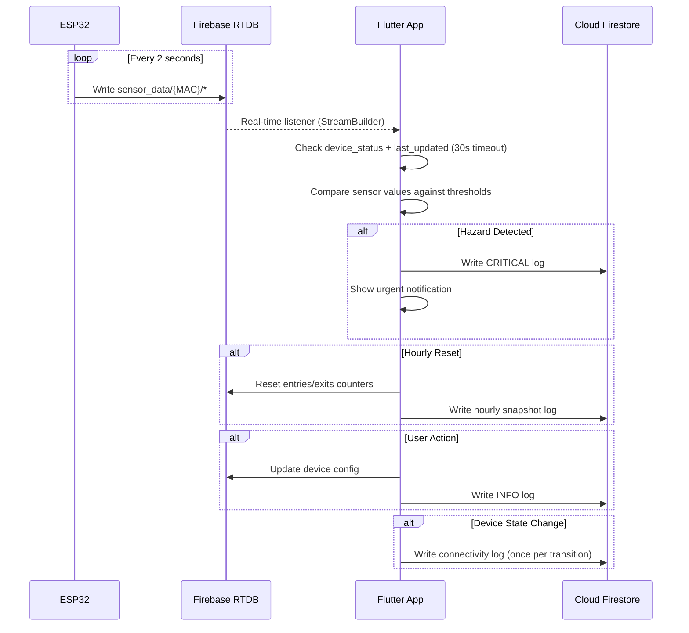

# Product Requirements Document (PRD): CrowdSense

**Project Name:** CrowdSense: Intelligent Crowd Monitoring and Emergency Alert System
**Project Type:** Computer Engineering Thesis
**Target Academic Standard:** Polytechnic University of the Philippines – College of Engineering and Architecture (PUP CEA)
**Tech Stack:** Flutter (Frontend), Firebase RTDB + Cloud Firestore (Backend/Database), ESP32 WROOM32D (Hardware), Arduino IDE (Firmware)
**Communication Protocol:** Firebase ESP Client SDK (REST-based) and JSON
**Version:** 1.1
**Last Updated:** 2026-04-21

---

## 1. Project Overview & Objective
CrowdSense is an integrated IoT and mobile application system designed to enhance building safety and spatial management. The system utilizes an ESP32 microcontroller equipped with a Time-of-Flight (ToF) sensor to accurately monitor foot traffic in hourly intervals, alongside a suite of environmental sensors (Flame, Gas/Smoke, Temperature) to detect potential fire hazards. The mobile app serves as the centralized command center, providing building administrators with real-time dashboards, historical analytics, device management, and critical emergency alerts when environmental thresholds are breached.

## 2. Target Audience & User Roles
* **Admin (e.g., Building Administrators):** Full system access. They can monitor building usage, manage ESP32 prototype units, adjust thresholds, and have the exclusive authority to create or delete user accounts (Admins and Facilitators). They can also edit their own account info.
* **Facilitator (e.g., Safety & Security Personnel):** Operational access. They have all the system management capabilities of an Admin (including adding/removing ESP32 connections and changing sensor thresholds), with the *only limitation* being they cannot add or delete user accounts. They can edit their own account info.

### 2.1 Permissions Matrix

| Role | RTDB Read | RTDB Write | Firestore Logs | User Management |
|---|---|---|---|---|
| **Admin** | ✅ All | ✅ All | ✅ Read + Write | ✅ Full CRUD |
| **Facilitator** | ✅ All | ✅ `prototype_units` + `settings` | ✅ Read + Write | ❌ None |

---

## 3. System Architecture & Data Flow

### 3.1 Three-Layer Architecture



### 3.2 Data Flow

* **Hardware Data Acquisition (ESP32):** The microcontroller continuously reads environmental data (Flame, Gas, Temperature) and processes local logic for the Time-of-Flight (ToF) entry/exit counts.
* **Hardware-to-Cloud Live Telemetry:** Every **2 seconds**, the ESP32 pushes all sensor readings to Firebase RTDB via the Firebase ESP Client SDK. This includes people count, environmental readings, hazard detection flags, and an NTP-synced timestamp.
* **Hardware-to-Cloud Emergency Interrupts:** If a hazard sensor crosses a critical threshold (flame ≤ 1000 AND gas ≥ 500), the ESP32 immediately activates the physical siren and updates `siren_active` in RTDB.
* **Cloud-to-App Real-Time Sync:** The Flutter app uses Firebase RTDB real-time listeners (`onValue` streams) to receive instant updates from all registered devices.
* **App-to-Firestore Activity Logs:** On specific events (hazard detection, user actions, hourly snapshots, connectivity transitions), the Flutter app writes structured log documents to Cloud Firestore for persistent historical records.



---

## 4. Core App Features (Requirements)

### 4.1. Real-Time Monitoring Dashboard
* **Active Hourly Counter:** Displays the net number of people (Entries minus Exits) currently inside the building for the active 1-hour window.
* **Sync & Reset Timer:** The app resets entry/exit counters every hour via `last_reset_hour` in RTDB. Each reset is logged to Firestore as an hourly snapshot.
* **Sensor Status Grid:** Displays real-time readings from the Temperature, Gas, and Flame sensors.
* **Area Crowd Count Cards:** Swipeable cards showing per-device occupancy with ONLINE/OFFLINE status badges. Devices are only considered ONLINE when `device_status` is not `"false"` AND `last_updated` is within 30 seconds.

### 4.2. Emergency Alert Protocol
* **Threshold Triggers:** The app reacts when Firebase registers data exceeding defined safety parameters.
* **Visual & Audio Alarms:** When an alert is triggered, the app screen displays a prominent warning overlay.
* **Tactical Alert Buttons (Alerts Page):**

| # | Button | Function | Status |
|---|---|---|---|
| 1 | 🔴 **FIRE ALERT** | Triggers `siren_alert_active` on all devices (strobe + siren) | ✅ Implemented |
| 2 | 🔵 **SAFETY ALERT** | Visual strobe signaling for safety announcements | ✅ Implemented |
| 3 | 🟢 **RESET ALL** | Full ESP32 hardware restart across all registered devices | ⏳ Planned |

> The **Reset All** button will send a restart command to all ESP32 modules, equivalent to pressing each device's physical reset button. This resets sirens, sensor states, and all counters simultaneously.

### 4.3. Analytics & Device Activity Logs
* **Hourly Foot Traffic Logs:** Logged to Firestore on each hourly reset, showing entries, exits, and net inside count per device.
* **Hazard & Activity Logs:** Chronological Firestore records of hazard triggers, user actions, and device state changes (see Section 6).

### 4.4. Device & System Management
* **Hardware Connectivity Status:** ONLINE/OFFLINE indicator per device, determined by `device_status` + 30-second `last_updated` timeout.
* **Threshold Configuration:** Settings page where Admins and Facilitators can adjust trigger points via sliders.
* **Device Provisioning:** Adding or removing ESP32 prototype units (accessible to both Admins and Facilitators).
* **User Management:** Administrative interface exclusively for Admins to create or delete user accounts.
  * **Constraint:** Strict one-email-per-account policy; duplicate emails are explicitly forbidden across the authentication system.
  * **Onboarding Flow:** New Admins/Facilitators receive an auto-generated temporary password via email. The client app tracks a `requiresPasswordChange` flag to enforce a mandatory password reset screen on their very first login.

---

## 5. Database Schema

### 5.1 Firebase Realtime Database (Live State)

#### `sensor_data/{MAC}` — Written by ESP32 every 2 seconds

| Key | Type | Source | Description |
|---|---|---|---|
| `people_inside` | int | ToF | Current occupancy count |
| `total_entries` | int | ToF | Cumulative entry count |
| `total_exits` | int | ToF | Cumulative exit count |
| `temperature` | float | DS18B20 | Current temperature in °C |
| `gas` | int | MQ sensor | Raw analog value (0–4095) |
| `gas_percentage` | int | MQ sensor | Mapped 0–100% |
| `flame` | int | Backup analog | Raw analog flame value (0–4095) |
| `flame_detected` | bool | Arduino | `true` when backup analog ≤ 1000 |
| `gas_detected` | bool | Arduino | `true` when analog ≥ 500 |
| `siren_active` | bool | Arduino | `true` when flame AND gas both exceeded |
| `last_updated` | int | NTP epoch ms | Used by app for 30s offline timeout |
| `device_status` | string | Arduino | `"true"` when WiFi connected |
| `power_status` | string | Arduino | `"High"` / `"Adequate"` / `"Low"` |
| `last_reset_hour` | int | Flutter | Tracks hourly counter resets |
| `siren_alert_active` | bool | Flutter | Manual alert trigger from app |
| `siren_clear_active` | bool | Flutter | Manual clear trigger from app |

#### `prototype_units/{MAC}` — Device Registration (Written by Flutter)

| Key | Type | Description |
|---|---|---|
| `name` | string | User-assigned device name (e.g., "Parking Area") |
| `priority` | int | Display order across all screens |
| `config/temp_threshold` | float | Temperature alert threshold (default: 35°C) |
| `config/smoke_threshold` | float | Smoke alert threshold (default: 300 PPM) |
| `config/flame_threshold` | float | Flame alert threshold (default: 200 PPM) |
| `config/include_in_headcount` | bool | Whether device contributes to global headcount |

### 5.2 Cloud Firestore (Activity Logs)

**Collection:** `activity_logs`

Every log document shares these common fields:
```json
{
  "id":        "auto-generated",
  "type":      "user | tof | flame | gas | temperature | siren | power | connectivity",
  "priority":  "CRITICAL | WARNING | INFO",
  "deviceMAC": "SAMPLE MAC ADD",
  "location":  "Parking Area",
  "timestamp": "Firestore server timestamp",
  "message":   "Human-readable summary string"
}
```

---

## 6. Firestore Activity Log Categories

**Priority Tiers:** 🔴 CRITICAL / 🟡 WARNING / 🟢 INFO
*(Distinct from Power labels High/Adequate/Low to avoid confusion)*

### 6.1 User Activity Logs

| Log Event | Priority | Key Fields |
|---|---|---|
| User Login | 🟢 INFO | `userId`, `email`, `role`, `platform` |
| User Logout | 🟢 INFO | `userId`, `email` |
| Device Added | 🟢 INFO | `userId`, `deviceMAC`, `deviceName` |
| Device Removed | 🟡 WARNING | `userId`, `deviceMAC`, `deviceName` |
| Device Settings Changed | 🟢 INFO | `userId`, `deviceMAC`, `field`, `oldValue`, `newValue` |

### 6.2 Time-of-Flight (ToF) Logs

| Log Event | Priority | Key Fields |
|---|---|---|
| Hourly Count Snapshot | 🟢 INFO | `deviceMAC`, `entriesThisHour`, `exitsThisHour`, `netInsideAtReset`, `resetHour` |

> No "High Traffic Alert" — there is no defined occupancy limit for the building.

### 6.3 Flame Sensor Logs

| Log Event | Priority | Key Fields |
|---|---|---|
| Flame Detected (Backup Analog) | 🔴 CRITICAL | `deviceMAC`, `sensorType`, `rawValue` |
| Flame Detected (Main Digital) | 🔴 CRITICAL | `deviceMAC`, `sensorType` |
| Flame Cleared | 🟢 INFO | `deviceMAC`, `durationSeconds` |

### 6.4 Gas/Smoke Sensor Logs

| Log Event | Priority | Key Fields |
|---|---|---|
| Gas/Smoke Detected | 🔴 CRITICAL | `deviceMAC`, `rawValue`, `percentage` |
| Gas/Smoke Cleared | 🟢 INFO | `deviceMAC`, `peakValue`, `durationSeconds` |

### 6.5 Temperature Sensor Logs

| Log Event | Priority | Key Fields |
|---|---|---|
| High Temperature Alert | 🟡 WARNING | `deviceMAC`, `currentTemp`, `threshold` |
| Critical Temperature (≥50°C) | 🔴 CRITICAL | `deviceMAC`, `currentTemp` |
| Temperature Normalized | 🟢 INFO | `deviceMAC`, `peakTemp`, `durationSeconds` |
| Sensor Fault (-127°C) | 🟡 WARNING | `deviceMAC`, `rawValue` |

### 6.6 Siren / Emergency Logs

| Log Event | Priority | Key Fields |
|---|---|---|
| Siren Activated (auto) | 🔴 CRITICAL | `deviceMAC`, `triggerSource`, `flameValue`, `gasValue` |
| Siren Deactivated | 🟢 INFO | `deviceMAC`, `activeDurationSeconds` |
| Manual Siren Alert | 🔴 CRITICAL | `deviceMAC`, `triggeredBy` (userId) |
| Manual Siren Clear | 🟢 INFO | `deviceMAC`, `clearedBy` (userId) |
| ESP32 Device Restart | 🟡 WARNING | `triggeredBy` (userId), `devicesAffected[]` |

> The ESP32 Device Restart is a full hardware reboot triggered from the Alerts page (green button). This resets sirens, sensor states, and counters. *(Planned, not yet fully implemented.)*

### 6.7 Power / Battery Logs

| Power Level | RTDB Value | UI Badge |
|---|---|---|
| Full | `"High"` | ⚡ Green |
| Moderate | `"Adequate"` | ⚡ Amber |
| Critical | `"Low"` | ⚠️ Blinking Red |

| Log Event | Priority | Key Fields |
|---|---|---|
| Power Level Changed | 🟢 INFO (or 🟡 if → Low) | `deviceMAC`, `previousLevel`, `newLevel` |

### 6.8 Device Connectivity Logs

Logged **only on state transitions** (OFFLINE → ONLINE or ONLINE → OFFLINE), NOT periodic heartbeats.

| Log Event | Priority | Key Fields |
|---|---|---|
| Device Came Online | 🟢 INFO | `deviceMAC`, `previousOfflineDuration` |
| Device Went Offline | 🟡 WARNING | `deviceMAC`, `lastSeenTimestamp` |

---

## 7. Sensor Threshold Guidelines

| Sensor Type | Hardware Trigger (Arduino) | App-Configurable (RTDB config) | Notes |
|---|---|---|---|
| **Temperature** | None (app-side only) | `temp_threshold` (default: 35°C) | DS18B20 returns -127°C on fault |
| **Gas / Smoke** | `≥ 500` raw analog | `smoke_threshold` (default: 300 PPM) | Arduino does NOT read app config |
| **Flame (Backup)** | `≤ 1000` raw analog | `flame_threshold` (default: 200 PPM) | Arduino does NOT read app config |
| **Flame (Main)** | Digital LOW | N/A | Immediate detection |
| **Siren** | Flame ≤ 1000 AND Gas ≥ 500 | N/A | Both conditions required |
| **ToF (Count)** | Continuous counting | N/A | Resets & logs every 1 hour |

> **Note:** The app-configurable thresholds stored in `config` are currently used only for UI display. The Arduino firmware uses hardcoded values. A future firmware update should have the ESP32 read the `config` node on boot.

---

## 8. Hardware Specifications

### 8.1 Firmware Variants

| Variant | File | Capabilities |
|---|---|---|
| `crowdsense_8CX` | `crowdsense_8CX.ino` | Firebase-connected, VL53L8CX, NTP timestamps, dual flame sensors |
| `crowdsense_7CX` | `crowdsense_7CX.ino` | Standalone, VL53L7CX, OLED display, WiFi AP only (no Firebase) |

### 8.2 Pin Assignments (8CX)

| Pin | Component |
|---|---|
| 21/22 | I2C (SDA/SCL) for VL53L8CX |
| 4 | DS18B20 Temperature |
| 14 | Main Flame (Digital) |
| 5 | Backup Flame (Digital) |
| 34 | Backup Flame (Analog) |
| 33 | Gas (Digital) |
| 35 | Gas (Analog) |
| 18 | Siren 1 |
| 19 | Siren 2 |

### 8.3 Data Transmission
- **Interval:** Every 2 seconds
- **Auth:** Firebase Legacy Token
- **Timestamps:** NTP-synced epoch milliseconds (GMT+8)

---

## 9. Known Issues & Recommendations

| # | Issue | Impact | Recommendation |
|---|---|---|---|
| 1 | App threshold sliders don't affect Arduino | Users think they're adjusting real thresholds | ESP32 should read `config` node on boot |
| 2 | Duplicate RTDB fields (`status` + `device_status`) | Data clutter | Remove `status`; standardize on `device_status` |
| 3 | `timestamp` field uses `millis()` not NTP | No real-world meaning | Remove or convert to NTP epoch |
| 4 | `power_status` not written by 8CX firmware | Stays at "Unknown" | Add battery monitoring to firmware |
| 5 | `WiFiManager.resetSettings()` called every boot | Forces WiFi reconfiguration each power cycle | Remove to persist WiFi credentials |

---

## 10. Non-Functional Requirements
* **Latency:** The delay between a sensor detecting a hazard and the Flutter app displaying the alert should be under 2 seconds.
* **Reliability:** The ESP32 must have a reconnection protocol if the Wi-Fi drops, caching the current hour's ToF count locally to ensure data isn't permanently lost.
* **UI/UX:** Premium glassmorphic interface with deep navy/cyan palette. High-contrast and readable at a glance, especially during emergencies.
* **Firestore Budget:** All activity logging must remain within Firebase's free tier (20,000 writes/day, 50,000 reads/day, 1GB storage).